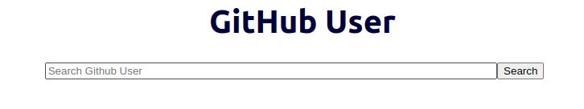
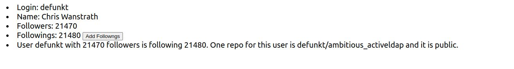

# Getting Started

This project use React as frontend and use java spring-boot as backend.
Jar and Build files are also uploaded.

## Requirement
- Java v11
- node v16
- Redis

## Running code

### Step1: start redis service
```
sudo service redis-server start
```

Please make sure your redis service is running on port 6379

### Step2: start java springboot service

under the folder "/GithubUser/GithubCrawler/"
```
java -jar GithubCrawler-0.0.1-SNAPSHOT.jar
```
springboot project will be on localhost:8000

### Step3: start react
under the folder "GithubUser/githubreact/"
```
sudo npm install -g serve
sudo npx -s build -p 8080
```
React website can be visited on localhost:8080

The home page:



you can enter the github signin name into input box. Then click search button.

The result pages will look like this.

You can also visit the result page directly by http://localhost:8080/Users/{User}.
## The basic logic of this application:

### How to get the data:
- Input "localhost:8080/Users/{User}" ---- react use useEffect to send Get "localhost:8000/Users/{User}" ---- Java Springboot Controller handle this request.
- The requests to GitHub are divided to two part.
	- 1. request the user information by https://api.github.com/users/octocat
	- 2. request the user repos by https://api.github.com/users/octocat/repos
- Currently, this application cannot extract private repo from github. If you want to access private repos, you should integrate OAuth with SpringBoot to obtain access token.
- When the website is wating for the fetched date, the page show "Still loading...". If the react fail to fetch data. The page will be redirected to error page.

### Following Value Change:
- State Hook is used to allowed the website to update followings value after each click without page refresh.

### Backend Structure
- MVC structure.
- Controller Layer: Handle Restful api from React.
- Service Later: Implement Bussiness Logic
- DAO(Repository) layer: Data Acces to redis/github server.
- Entity: Object Model (User and Repo in this project)

### Error Handling:
- A error page is setted in react project. If the react cannot fetch the correct data from springboot (e.g. springboot is down, github api is refused by github, the user does not exist), the page will be redirect to error page.
- The Exception Handling of Spring Boot is used its default Handler

### Redis:
- Because github api has rate limitation and fetching data from Github server is time consuming, Redis is used to reduce latency.
- The logic of redice: when react get request arrives spring boot, spring boot will firstly check whether the data exists in Redis. If yes, spring boot will get the data and referesh the expiration time of this data. If no, spring boot will make a request to github server and save the acquired data into redis with 10 minutes exipration time.
